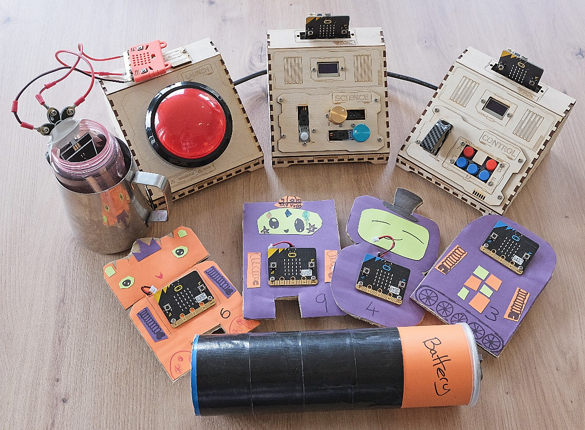

<h2 align="center">
	 
	
	Fix the Space Ship - A STEM Engagement Escape Room
</h2>

    
    

Fix the Space Ship is a short escape room activity, designed to get kids interested in technology and coding. 

This repo contains all the code and designs used to create the activity.  I hope it is useful either as inspiration for creating similar escape rooms, or for even having a go at recreating this one for your own groups.

## Components

The Escape Room is made up of a series of different steps.  Each one is described in full in it's own Read Me file, which includes photos and a guide on how to build it.

### Manual

The Space Ship manual is given to teams at the start of the challenge, and tells them what they need to do at each step.

[Space Ship Manual](Spaceship%20Challenge%20Manual.pdf)

For an editable version, the original Google document is [here](https://docs.google.com/document/d/1UZmQcw_lCy3J1W7tHfdochccHPePtWkxOZ1arFSAfAo/edit?usp=sharing).

### Step 1 - Robots and Refeulling
Robots: [Read Me](src/step-1a/README.md) | [Code](src/step-1a/robots.py) 
Refuelling: [Read Me](src/step-1b/README.md) | [Code](src/step-1b/refuel.py)

Step 1 has teams putting robots in the correct order to find a code, which they use to unlock the fuel store.  They then have to fill up the fuel tank to the correct level.

### Step 2 - Charge the Battery
Battery: [Read Me](src/step-2/README.md) | [Code](src/step-2/battery.py)

In step 2 teams must charge a battery, by running around while holding it.

### Step 3 & 4 - Set the Course & Send a Message
Science Unit: [Read Me](src/science/README.md) | [Code](src/science/science.py)

Steps 3 and 4 are handled by the Science Unit console.  Teams must use the sensor readings to work out where they are, then set a course for space HQ.  They then shout a message into the microphone to say they're on their way home.

### Step 5 - Launch Sequence
Control Unit: [Read Me](src/control/README.md) | [Code](src/control/control.py)

In step 5, teams follow a frantic series of instructions shown on the control and science consoles.

## Parts List

This page lists all the [components](parts.md) used in the build of the escape room.  Each individual Read me also lists the parts used for that step.

## 💝 Thanks to

- [brainthee](https://github.com/brainthee) - for designing the console boxes & help with construction

## Licence

I'd love for you to make use of the resources here to build and run this challenge, or to modify and make your own version.  If you do, please include a credit to me (Andy Briggs - brggs.co.uk).  Please do send me a message to let me know how you get on!

The designs, code and documentation are licenced under the [Creative Commons Attribution 4.0 International Public License](https://creativecommons.org/licenses/by/4.0/legalcode), see the [LICENSE](LICENSE) file.

    

