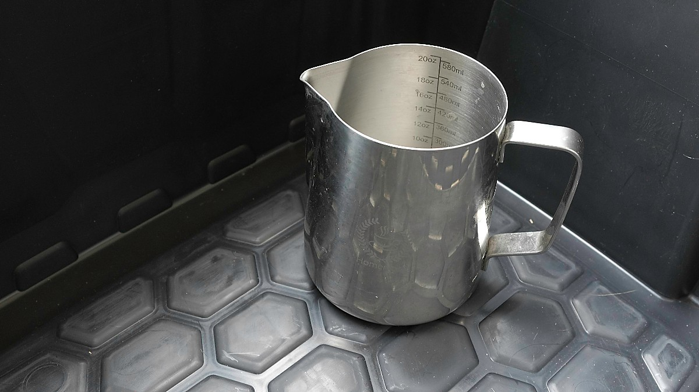
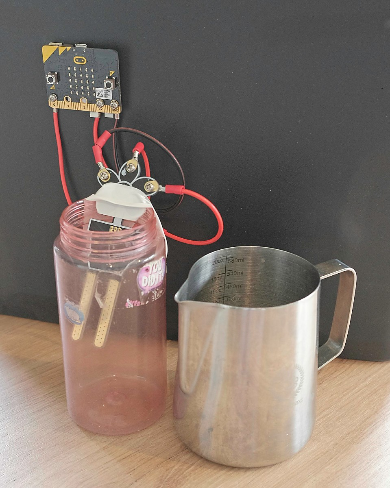

# Step 1b - Fuel Tank

This step involves filling up the fuel tank. 

Teams must first unlock the fuel supply, using the code they obtained in the previous step.  I used a lockable plastic box, with a jug of water contained inside:

Make sure teams don't pick up the box and spill the water!  You could also just fill the contianer with water, then have teams fill the jug from it.

They must then carry water from the reserves, using a jug, to fill up the tank to a specific level.  If they overfill, they'll need to take water back out to get back to the required level.

When the water is at the correct level for a few seconds, the micro:bit sends a message to the command console to indicate success.

As you can see from the photo, this part of the build was not very sophisticated, and there is plenty of room for improvement!

This simple approach worked fine, but you may wish to have a go at building a better enclosure for the fuel container, with somewhere to mount the micro:bit.

## Equipment List

* A micro:bit (v1 or v2)
* Water sensor, and wires to attach it to the micro:bit
* Battery pack
* Lockable Container
* Jug for carrying water
* Fuel container (water bottle with wide opening)

## Build

1. Use the [micro:bit editor](https://python.microbit.org/v/3/) to download the [code](refuel.py) onto the micro:bit
2. Attach the wires from the sensor to the micro:bit
3. Fix the sensor into the fuel container
4. Attach the micro:bit somewhere above the fuel container, where it will be visible to the team while they are pouring in the water

## Setup/Reset

1. Lock the water away in the container
2. Ensure the fuel container is empty
3. Turn the micro:bit on

To reset, empty the water back out of the fuel container, then restart the micro:bit.  Put the jug back in the lockable container, and replace the lock.