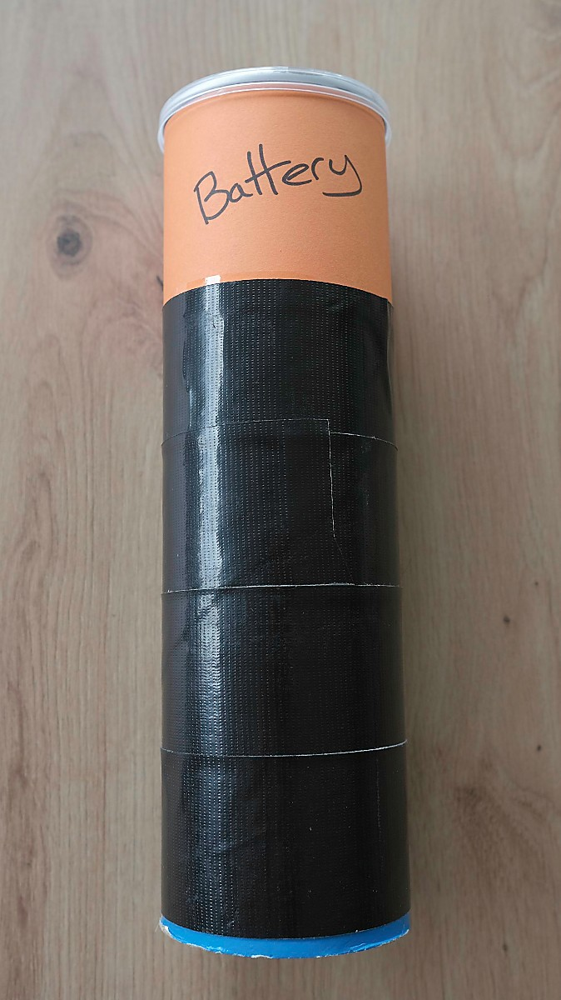
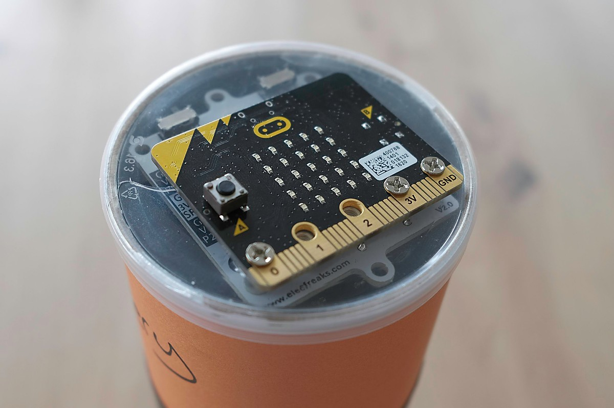
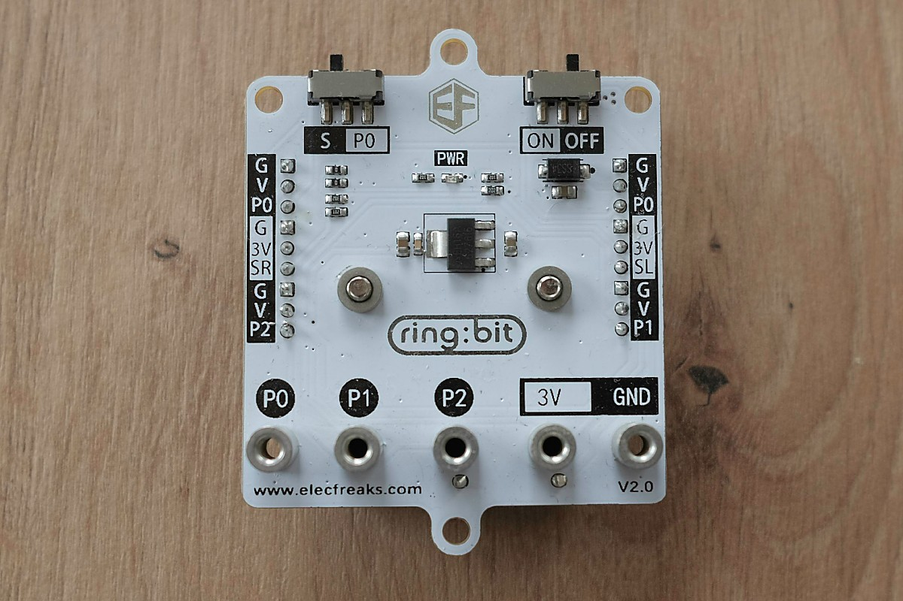

# Step 2 - Battery

In this step, teams have to charge a battery by running around with it.  The charge level is shown on the micro:bit display.

Once the charge reaches the max level, the micro:bit sends a message to the control unit to let it know the step is complete.

## Equipment List

* A micro:bit (v1 or v2)
* Micro bit batteries??? (but you could just tape a battery pack on the inside of the can)
* A Pringles can (or similar)
* Decoration (I used orange card & black tape, to mimic a common battery brand)

## Build

1. Decorate the pringles can to look like a battery
2. Use the [micro:bit editor](https://python.microbit.org/v/3/) to download the [code](battery.py) onto the micro:bit
3. Attach the micro:bit to the lid of the pringles - I used a ring:bit battery pack for this, screwing it onto the micro:bit with the pringles lid in the middle.  See the photo below.

## Setup/Reset

1. Turn the micro:bit on

To reset, restart the micro:bit.